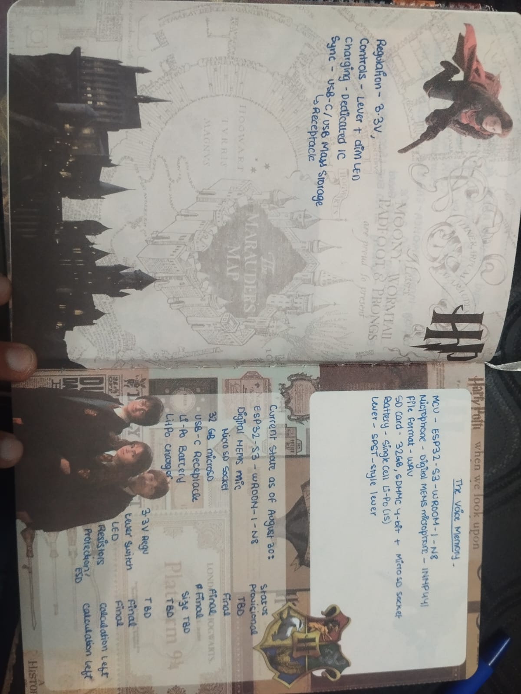
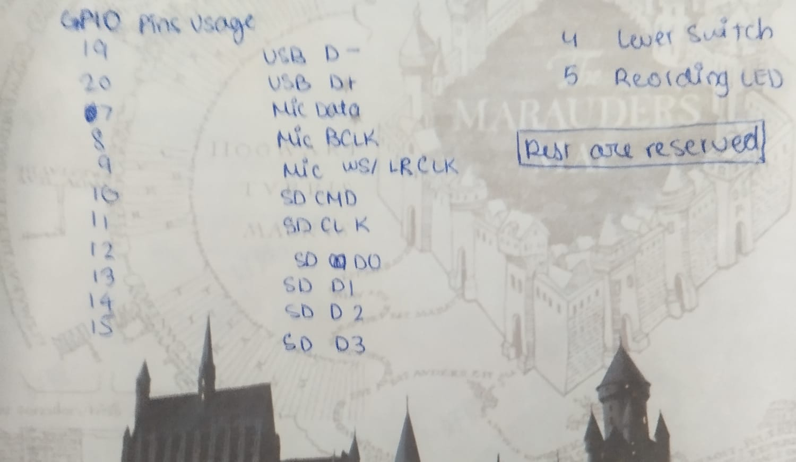
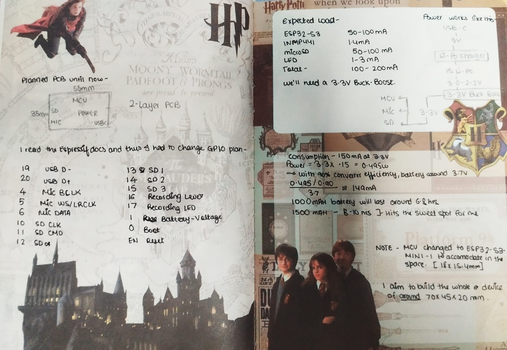
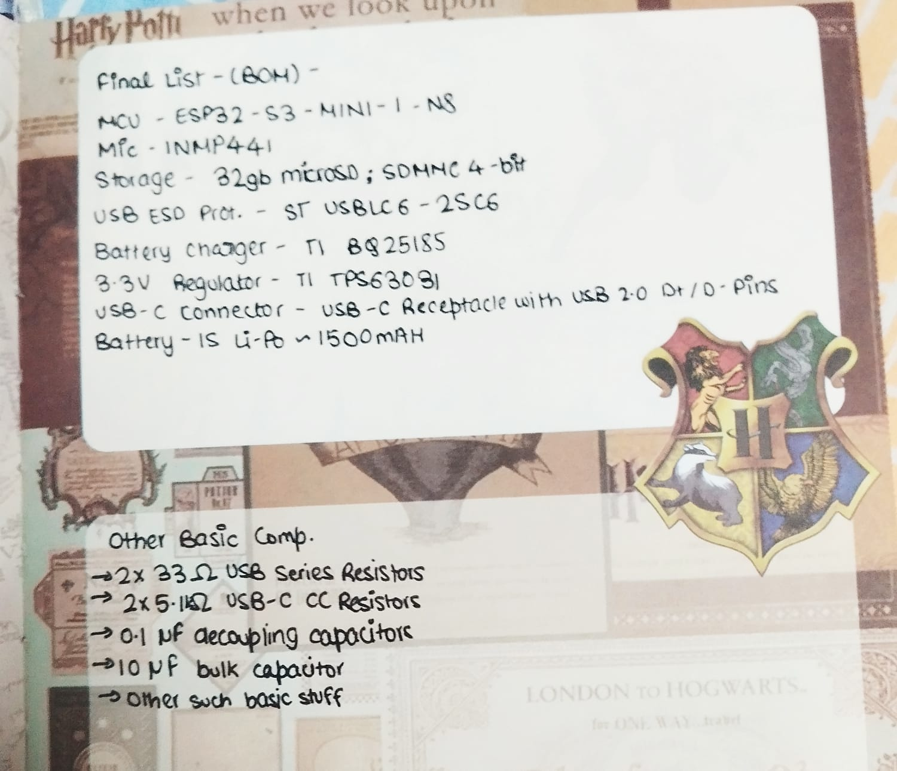

# voice_memory

## Entry 1: August 30
Today I researched all the components I'll need for my project as far as I could. This project focuses on serving me and not anyone else, so some features that were unnecessary to me are excluded. I created a list of components I'll need, with the exact models for those that are very important, and a few parts, like the resistors, are not yet decided, as calculations need to be done.

**total time spent: 1.0 hours**

## Entry 2: September 5
Today, first of all, I assigned all the components to their GPIO pins in my microcontroller (which, btw, I changed from the previous entry as I found one which was better for my use case) and calculated the battery, power and other necessary things that I need to calculate. I specified the aim for the dimensions of my final project, i.e 70x45x20mm. I also decided to use a buck-boost converter to achieve constant current in my power. Then I went on to create a rough diagram of how I want my PCB to look. As I was researching this, I found the Espressif docs and, while reading them, I learned my GPIO pins were set wrong, so I fixed them. Now I was a little clearer about my battery and charger, so I decided to create the BOM(all materials I would need as of now). The list is a rough draft for me, just so I can get an idea. That's it for today. I'll probably do the next entry after a few days because of my midterms, but let's see what happens.

**total time spent: 2.0 hours**
